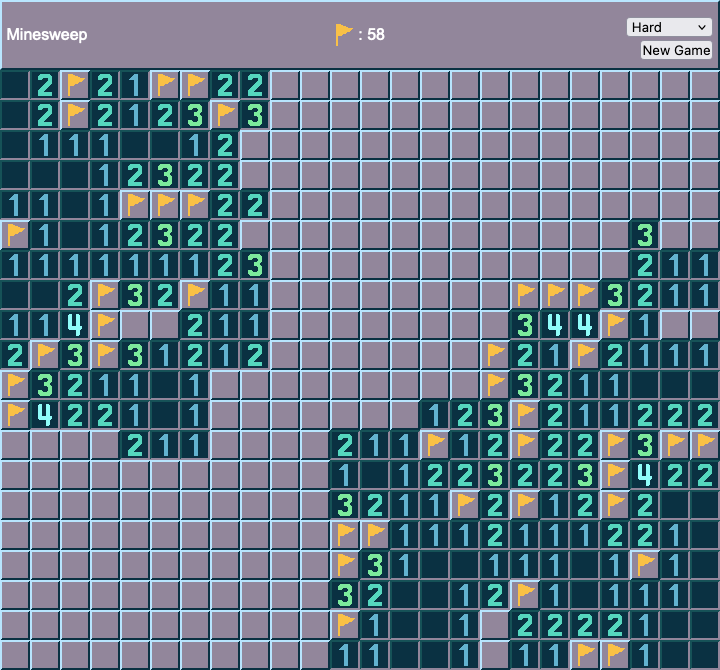
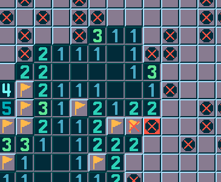
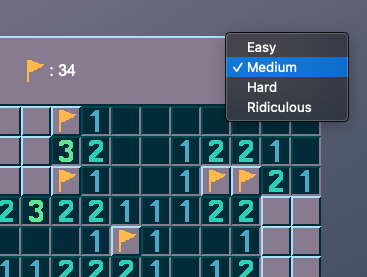

# Minesweeper

## Date: 8/13/21

#

### By: Sam Phillips

[GitHub](https://github.com/samkphillips) | [LinkedIn](https://www.linkedin.com/in/sam-phillips-8ba677168/)

#

**_Description_**

A simple and clean remake of the classic game of Minesweeper. Styled after the original but with an updated color scheme.

It was originally made for Project 1 in the GA SEI.

Progress is being tracked and planning done on [Trello](https://trello.com/b/TfPBJzEF/minesweeper-for-ga)

---

**_Technologies Used_**

- HTML / CSS
- JavaScript

---

**_Play!_**

You can play the most recent version, deployed using Surge, at the link below:
[Play Minesweeper](http://retrofutureminesweep.surge.sh/)

---

**_Screenshots_**

#### The classic game!

#### Shows you what went wrong ~~when~~ if you lose

#### Multiple difficulty options

---

**_To Do_**

- [x] MVP!
- [x] Add clear-around input
- [ ] Optional sound effects
- [ ] Adjust mine creation algorithm to prevent first clicked cell from being a mine to prevent false starts
- [ ] Adjust mine creation algorithm to prevent guesses in 50/50 split situations

---

**_Credits_**

[Coolors Color Schemes](https://coolors.co/)

[CSS Gradient Background](https://cssgradient.io/)
